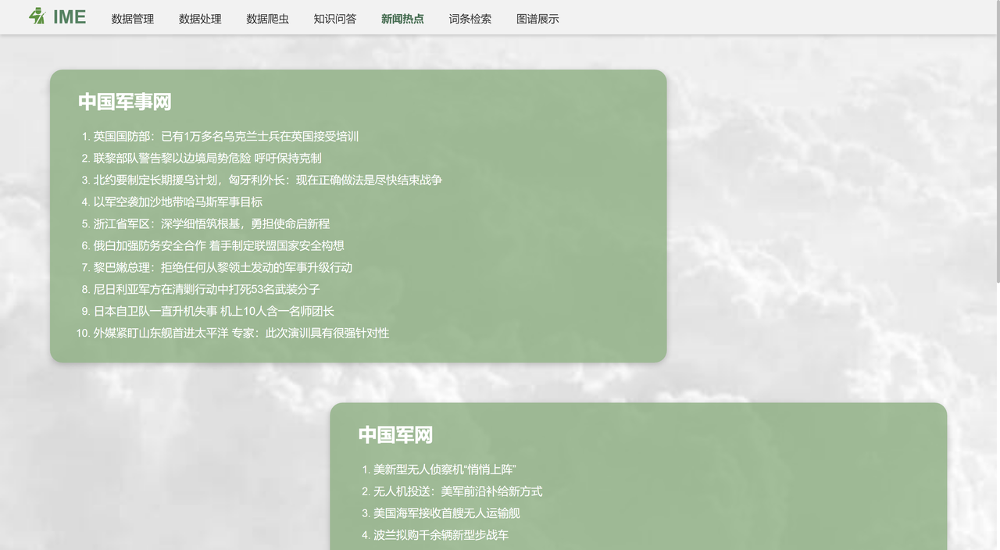

# Military-Equipment-Knowledge-Graph-Based-on-Deep-Learning-and-Neo4j
基于深度学习与Neo4j的军事装备知识图谱网页应用构建。本项目是一个军事武器知识图谱网页应用软件原型系统。该系统由数据爬虫、数据管理、数据处理、知识问答、新闻热点、词条查询和图谱展示七个功能模块组成。系统从互联网上爬取数据，并基于百度文心ERNIE 3.0模型对数据进行实体识别和关系抽取，将数据处理为三元组形式并存储到图数据库Neo4j中。通过数据管理和数据标注，并通过对Neo4j中的三元组数据进行自动处理和分析，实现知识问答、新闻热点、词条查询和图谱展示的功能。
# 项目详情
请关注CSDN主页：https://blog.csdn.net/m0_46573428
# 软件原型系统架构
本系统是一款军事武器装备信息管理与应用平台，主要分为“数据更新与管理”和“数据应用”两大功能部分。这个平台的设计目标主要有两点：一是实现对军事武器装备相关信息的全方位收集、维护和管理，二是通过多样化的查询方式，使广大用户能够轻松、高效地查找到所需的信息。
其中，“数据更新与管理”部分是该平台的核心功能和重要组成部分，旨在为全面、准确地维护和管理装备信息提供技术支持。平台采用爬虫技术，获取来自不同数据源的军事武器装备信息，如军事装备名称、型号、性能参数、生产厂家等。在此基础上，平台进行了实体和三元组自动抽取，并通过数据处理进行清洗、筛选、融合等处理，最终将数据存储在图数据库中以此保证数据的准确性和可用性。
“数据应用”部分则是平台提供的衍生功能，其中包含词条检索、知识问答、新闻热点和图谱展示等，以便于用户快速地获取所需的军事武器装备信息。
## 软件原型系统架构图

## 数据爬虫模块

## 数据管理模块

## 数据处理模块

## 知识问答模块

## 新闻热点模块

## 词条检索模块

## 图谱展示模块

